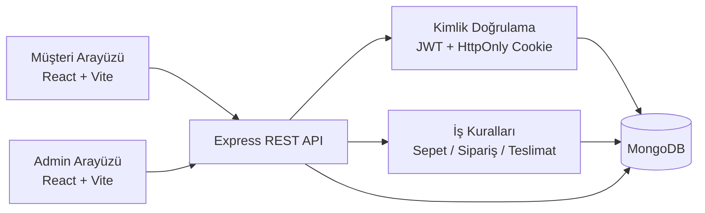

# Paşalı Patisserie Sipariş Yönetim Sistemi

[](https://github.com/ranakaragol/bakery-order-management-system/actions/workflows/ci.yml)

Paşalı Patisserie için geliştirilen bu proje; React tabanlı müşteri ve yönetici arayüzleri, Express tabanlı REST API katmanı ve MongoDB veri modeliyle çalışan tam yığın (full-stack) bir sipariş yönetim sistemidir. Uygulama; ürün ve kategori vitrini, sepet, sipariş oluşturma, profil ve adres yönetimi, admin paneli, güvenli oturum yönetimi ve temel kalite güvence altyapılarını tek repoda toplar.

## Projenin Amacı

Amaç, butik bir pastane operasyonunun hem müşteri tarafı sipariş akışını hem de iç operasyon yönetimini aynı kod tabanında sürdürülebilir biçimde yönetebilmektir. Bu kapsamda proje:

- müşteri kayıt, giriş ve oturum geri yükleme akışlarını,
- kategori ve ürün kataloğunu,
- kg, adet ve pasta boyutu gibi farklı satış biçimlerini,
- teslimat bölgesi ve minimum sipariş kurallarını,
- sepetten siparişe uzanan iş akışını,
- admin tarafında ürün, kategori, sipariş ve içerik yönetimini

tek bir sistem altında birleştirir.

## Temel Özellikler

### Müşteri tarafı

- Kayıt olma ve giriş yapma
- HttpOnly cookie ile oturumun sayfa yenilemede korunması
- Profil, teslimat adresi ve fatura bilgisi yönetimi
- Kategori ve ürün listeleme
- Ürün detay sayfası
- Sepete ekleme, miktar güncelleme ve sepet temizleme
- Bölgeye göre minimum sipariş ve teslimat kontrolü
- Checkout ve sipariş oluşturma
- Sipariş geçmişi görüntüleme

### Admin tarafı

- Admin role özel korumalı panel
- Ürün oluşturma, güncelleme ve silme
- Kategori oluşturma, güncelleme, sıralama, pasifleştirme ve güvenli silme
- Siparişleri görüntüleme ve durum güncelleme
- Müşteri kayıtları ve sipariş geçmişlerini görüntüleme
- Site iletişim / ödeme / hakkımızda içeriklerini güncelleme
- Admin profil yönetimi

## Kullanılan Teknolojiler

| Katman | Teknolojiler |
| --- | --- |
| Frontend | React 18, Vite, React Router, Axios |
| Backend | Node.js, Express |
| Veri katmanı | MongoDB, Mongoose |
| Kimlik doğrulama | JWT, HttpOnly cookie |
| Güvenlik | Helmet, CORS allowlist, CSRF middleware, express-rate-limit, bcryptjs |
| Test | Vitest, Supertest, Node test runner |
| Kod kalitesi | ESLint 9, jsx-a11y, React Hooks lint kuralları |
| CI | GitHub Actions |
| Geliştirme altyapısı | Docker Compose (MongoDB + Mongo Express) |

## Sistem Mimarisi



- Frontend, müşteri ve admin akışlarını aynı React uygulaması içinde yönetir.
- Backend, rol kontrollü REST endpoint’leri sağlar.
- Authentication katmanı JWT üretir; token JavaScript tarafından okunmayan HttpOnly cookie olarak taşınır.
- Sipariş toplamı, ürün uygunluğu ve teslimat koşulları backend iş kurallarıyla yeniden doğrulanır.
- MongoDB; kullanıcı, ürün, kategori, sepet, sipariş ve iletişim verilerini saklar.

## Kullanıcı Rolleri

| Rol | Yetkiler |
| --- | --- |
| Ziyaretçi | Ana sayfa, ürünler, kategoriler ve iletişim içeriklerini görüntüler |
| Müşteri (`customer`) | Kayıt olur, giriş yapar, profilini yönetir, sepet kullanır, sipariş verir, kendi siparişlerini görüntüler |
| Yönetici (`admin`) | Admin paneline erişir, ürün/kategori/sipariş/müşteri verilerini yönetir, site içeriklerini günceller |

## Müşteri Akışı

1. Kullanıcı kayıt olur veya giriş yapar.
2. Oturum cookie üzerinden korunur; sayfa yenilendiğinde frontend `/api/auth/me` ile oturumu geri yükler.
3. Kullanıcı kategori ve ürünleri inceler.
4. Uygun ürünleri sepete ekler.
5. Sepet ekranında miktar değiştirir ve teslimat bölgesi kaynaklı minimum sipariş uyarılarını görür.
6. Checkout ekranında teslimat ve fatura bilgilerini tamamlar.
7. Sipariş oluşturulurken backend, sepet ürünlerini ve toplam tutarı tekrar hesaplar.
8. Sipariş başarıyla oluşturulduktan sonra müşteri sipariş geçmişini görüntüler.

## Admin Özellikleri

### Ürün oluşturma ve güncelleme

- Ürünler kategori seçimi üzerinden yönetilir.
- Admin; kategoriye göre filtreleme, ürün seçimi ve düzenleme akışını kullanır.
- Farklı satış birimlerine göre form alanları değişir.

### Kategori oluşturma, sıralama ve pasifleştirme

- Kategori listesi; ad, slug, sıralama ve aktiflik durumuyla görüntülenir.
- Yeni kategori oluşturma ve mevcut kategoriyi düzenleme akışları ayrıdır.
- Pasif kategori müşteri kataloğunda görünmez, ancak admin listesinde görünmeye devam eder.

### Güvenli kategori silme

- Silme öncesinde backend, kategoriye bağlı ürün sayısını kontrol eder.
- Bağlı ürün varsa `409 Conflict` döner ve kategori silinmez.

### Sipariş yönetimi

- Tüm siparişler admin panelinde listelenir.
- Sipariş durumu güncellenebilir.
- Admin; siparişe bağlı müşteri ve fatura bilgilerini görebilir.

### Müşteri görünümü ve admin profil yönetimi

- Admin, müşteri kayıtlarını ve geçmiş siparişlerini görüntüleyebilir.
- Admin profil ekranından kendi hesap bilgilerini ve site iletişim içeriklerini güncelleyebilir.

## Teslimat ve Sipariş Kuralları

Kodda doğrulanan temel iş kuralları:

- İstanbul Anadolu Yakası teslimat bölgesi ücretsizdir.
- İstanbul Avrupa Yakası ve Kocaeli için minimum sipariş tutarı `2.000 TL`’dir.
- Minimum sipariş kuralı hem frontend uyarılarında hem backend sipariş doğrulamasında uygulanır.
- `kg` ile satılan ürünlerde miktar doğrulaması `0,1` artışlarla yapılır; bu nedenle `0,5`, `1,5` gibi değerler desteklenir.
- `adet` ve benzeri birimlerde miktar tam sayı olmak zorundadır.
- Sipariş toplamı backend tarafından sepet içeriği ve güncel ürün fiyatı üzerinden yeniden hesaplanır.
- Pasif ürün, stok dışı ürün veya silinmiş ürün sipariş aşamasında reddedilir.
- Pasif kategoriler müşteri kataloğunda gösterilmez; siparişte de görünmez kabul edilir.
- Checkout sırasında girilen teslimat ve fatura bilgileri sipariş kayıtlarında snapshot olarak korunur.
- Kullanıcı profilini daha sonra değiştirse bile mevcut sipariş kayıtlarındaki adres özetleri bozulmaz.

## Güvenlik Özellikleri

- JWT, frontend JavaScript tarafından okunamayan HttpOnly authentication cookie içinde taşınır.
- Parolalar `bcryptjs` ile hash’lenir.
- Backend route’larında `protect` ve `allowRoles` middleware’leri ile rol kontrolü yapılır.
- CORS allowlist mantığı `ALLOWED_ORIGINS` ve `CLIENT_URL` ile yönetilir; wildcard origin + credentials kombinasyonu kullanılmaz.
- CSRF koruması environment ayarına bağlıdır. `CSRF_PROTECTION_ENABLED=true` olduğunda veya `AUTH_COOKIE_SAME_SITE=none` seçildiğinde ilgili middleware cookie + `x-csrf-token` eşleşmesi bekler.
- Helmet varsayılan güvenlik başlıklarını ekler.
- Login endpoint’i için `10 istek / 15 dakika`, register endpoint’i için `5 istek / 60 dakika`, genel API için `300 istek / 15 dakika` rate limit uygulanır.
- Merkezi hata middleware’i duplicate key (`11000`) hatalarını `409 Conflict` olarak döndürür.
- Production ortamında generic `500` cevapları stack trace sızdırmaz.
- Sipariş toplamı veya istemciden gelen ara toplam değerlerine güvenilmez; backend kendi hesabını yapar.

## Proje Klasör Yapısı

```text
bakery-order-management-system/
├── backend/
│   ├── src/
│   │   ├── config/
│   │   ├── controllers/
│   │   ├── data/
│   │   ├── middleware/
│   │   ├── models/
│   │   ├── routes/
│   │   ├── tests/
│   │   ├── utils/
│   │   └── validators/
│   ├── .env.example
│   └── package.json
├── frontend/
│   ├── src/
│   │   ├── api/
│   │   ├── components/
│   │   ├── context/
│   │   ├── data/
│   │   ├── guards/
│   │   ├── layouts/
│   │   ├── pages/
│   │   │   ├── admin/
│   │   │   └── customer/
│   │   ├── styles/
│   │   └── utils/
│   ├── .env.example
│   └── package.json
├── scripts/
├── shared/
├── docker-compose.yml
├── .env.example
├── eslint.config.js
└── .github/workflows/ci.yml
```

## Yerel Kurulum

### Ön koşullar

- Node.js `22` veya üzeri
- npm
- Docker Desktop veya Docker Engine

### 1. Repository’yi klonlayın

```bash
git clone https://github.com/ranakaragol/bakery-order-management-system.git
cd bakery-order-management-system
```

### 2. Bağımlılıkları yükleyin

```bash
npm install
npm --prefix backend install
npm --prefix frontend install
```

### 3. Environment dosyalarını hazırlayın

Önerilen yaklaşım:

```bash
cp backend/.env.example backend/.env
cp frontend/.env.example frontend/.env
```

Root seviyesindeki [.env.example](/Users/ranakaragol/Desktop/bakery-management/bakery-order-management-system/.env.example) dosyası ise backend ve frontend ayarlarını tek yerde görmek için referans olarak tutulur.

İsterseniz root referans dosyasını temel alarak kendi `.env` dosyalarınızı manuel de hazırlayabilirsiniz:

```bash
cp .env.example .env.reference.local
```

### 4. MongoDB’yi Docker ile başlatın

```bash
docker compose up -d mongo
```

İsterseniz Mongo Express’i de dahil ederek tüm compose servislerini açabilirsiniz:

```bash
docker compose up -d
```

### 5. Opsiyonel: admin hesabını hazırlayın

Sadece admin kullanıcısını oluşturmak / güncellemek için:

```bash
npm --prefix backend run seed:admin
```

Bu komut:

- veritabanını sıfırlamaz,
- yalnız admin hesabını oluşturur veya günceller,
- admin hesabı için gerekli `InvoiceInfo` kaydını da seed environment alanlarıyla eşler.

> Güvenlik notu: `.env.example` dosyalarındaki admin ve fatura bilgileri yalnızca geliştirme amaçlı sahte örneklerdir. Production veya gerçek ortamda `seed:admin` çalıştırılmadan önce bu değerleri güçlü ve ortama uygun gerçek değerlerle değiştirin. Gerçek değerleri yalnızca takip edilmeyen `backend/.env` dosyasında veya deployment secret yönetiminde saklayın.

> Not: `npm --prefix backend run seed` veritabanını temizleyip katalog ve admin verilerini yeniden yazar. Lokal denemelerde dikkatli kullanın.

### 6. Backend’i çalıştırın

```bash
npm run dev:backend
```

### 7. Frontend’i çalıştırın

```bash
npm run dev:frontend
```

### 8. Tek komutla geliştirme modunu açın

Backend ve frontend süreçlerini birlikte başlatmak için:

```bash
npm run dev
```

Bu komut beklenen portların dolu olup olmadığını kontrol eder ve çakışma varsa güvenli şekilde durur.

### 9. Health endpoint’i doğrulayın

```bash
curl http://127.0.0.1:5001/api/health
```

İsterseniz geliştirme servislerinin durumunu şu komutla da görebilirsiniz:

```bash
npm run dev:status
```

## Environment Değişkenleri

Desteklenen environment değişkenleri aşağıdaki gibidir. Tablodaki örnekler güvenli geliştirme (development) örnekleridir; gerçek secret değerlerini commit etmeyin.

| Değişken | Zorunlu / Opsiyonel | Açıklama | Güvenli geliştirme örneği |
| --- | --- | --- | --- |
| `PORT` | Zorunlu | Backend HTTP portu | `5001` |
| `MONGO_URI` | Zorunlu | MongoDB bağlantı adresi | `mongodb://127.0.0.1:27017/bakery_order_management` |
| `JWT_SECRET` | Zorunlu | JWT imzalama secret’ı | `replace_with_a_long_random_secret` |
| `JWT_EXPIRES_IN` | Opsiyonel | JWT süresi | `7d` |
| `CLIENT_URL` | Önerilir | Frontend ana origin’i | `http://127.0.0.1:5173` |
| `ALLOWED_ORIGINS` | Opsiyonel | CORS allowlist, virgülle ayrılır | `http://127.0.0.1:5173,http://localhost:5173,http://127.0.0.1:4173,http://localhost:4173` |
| `AUTH_COOKIE_NAME` | Opsiyonel | Authentication cookie adı | `pasali_auth` |
| `AUTH_COOKIE_MAX_AGE_MS` | Opsiyonel | Auth cookie ömrü (ms) | `604800000` |
| `AUTH_COOKIE_SAME_SITE` | Opsiyonel | Auth cookie `sameSite` değeri | `lax` |
| `AUTH_COOKIE_SECURE` | Opsiyonel | Production’da `true` olmalıdır | `true` |
| `AUTH_COOKIE_DOMAIN` | Opsiyonel | Gerekliyse cookie domain’i | `.example.com` |
| `CSRF_PROTECTION_ENABLED` | Opsiyonel | CSRF middleware’i zorla etkinleştirir | `true` |
| `CSRF_COOKIE_NAME` | Opsiyonel | CSRF cookie adı | `pasali_csrf` |
| `AUTH_COOKIE_ALLOW_INSECURE_LOCALHOST_NONE` | Opsiyonel | Sadece açık localhost testleri için `sameSite=none` istisnası | `true` |
| `ADMIN_SEED_EMAIL` | Opsiyonel | Seed/upsert admin e-postası | `admin@example.com` |
| `ADMIN_SEED_PASSWORD` | Opsiyonel | Seed/upsert admin parolası | `ChangeMe123!` |
| `ADMIN_SEED_FIRST_NAME` | Opsiyonel | Seed/upsert admin adı | `Example` |
| `ADMIN_SEED_LAST_NAME` | Opsiyonel | Seed/upsert admin soyadı | `Admin` |
| `ADMIN_SEED_PHONE` | Opsiyonel | Seed/upsert admin telefonu | `+90 555 000 00 00` |
| `ADMIN_SEED_ADDRESS` | Opsiyonel | Seed/upsert admin adresi | `Example Address` |
| `ADMIN_SEED_TAX_NUMBER` | Gerekli (`seed:admin` için) | Admin `InvoiceInfo` vergi numarası placeholder’ı | `0000000000` |
| `ADMIN_SEED_TAX_OFFICE` | Gerekli (`seed:admin` için) | Admin `InvoiceInfo` vergi dairesi placeholder’ı | `Example Tax Office` |
| `VITE_API_URL` | Opsiyonel | Frontend API base URL. Boş bırakılırsa mevcut hostname + `:5001/api` kullanılır. | `http://127.0.0.1:5001/api` |
| `VITE_CSRF_COOKIE_NAME` | Opsiyonel | Frontend’in okuyacağı CSRF cookie adı | `pasali_csrf` |

## Uygulamayı Çalıştırma

Yerel geliştirmede tipik akış:

```bash
docker compose up -d mongo
npm run dev
```

Ardından:

- Frontend: `http://127.0.0.1:5173`
- Backend: `http://127.0.0.1:5001`
- Health: `http://127.0.0.1:5001/api/health`
- Mongo Express (opsiyonel): `http://localhost:8081`

## Test, Lint ve Build Komutları

| Komut | Açıklama |
| --- | --- |
| `npm run dev` | Frontend ve backend geliştirme süreçlerini birlikte başlatır |
| `npm run dev:status` | Frontend, backend ve MongoDB port durumlarını ve backend health bilgisini gösterir |
| `npm run lint` | Katalog doğrulaması + frontend ESLint + backend ESLint çalıştırır |
| `npm run lint:catalog` | Katalog verisi ve gramaj gösterimi doğrulamasını çalıştırır |
| `npm run lint:frontend` | `frontend/src` ve `frontend/vite.config.js` için ESLint çalıştırır |
| `npm run lint:backend` | `backend/src`, `shared` ve `scripts` için ESLint çalıştırır |
| `npm run test` | Backend testleri + frontend testlerini birlikte çalıştırır |
| `npm run build` | Frontend production build üretir |
| `npm run check` | `lint + test + build` zincirini tek komutta doğrular |

Ek backend scriptleri:

- `npm --prefix backend run seed`
- `npm --prefix backend run seed:admin`
- `npm --prefix backend run test`

## Docker ile MongoDB Çalıştırma

Projede tam stack Docker setup’ı değil, MongoDB odaklı bir `docker-compose.yml` bulunur.

### Servisler

- `mongo` -> MongoDB 7, port `27017`
- `mongo-express` -> Web arayüzü, port `8081`

### Örnek komutlar

```bash
docker compose up -d
docker compose ps
docker compose down
```

MongoDB verisi `mongo_data` volume içinde saklanır.

## API’nin Genel Yapısı

| Grup | Amaç | Yetki |
| --- | --- | --- |
| `/api/auth` | Register, login, logout, oturum geri yükleme (`/me`) ve auth odaklı profil güncelleme | Public + authenticated |
| `/api/profile` | Giriş yapmış kullanıcının profil ve parola işlemleri | Authenticated |
| `/api/categories` | Müşteri kategori listesi ve admin kategori CRUD işlemleri | Public + admin |
| `/api/products` | Müşteri ürün listesi/detayı ve admin ürün CRUD işlemleri | Public + admin |
| `/api/cart` | Sepet görüntüleme, ekleme, güncelleme, silme | `customer` |
| `/api/orders` | Sipariş oluşturma, kendi siparişleri ve sipariş detayı | `customer`, detay görüntülemede admin de erişebilir |
| `/api/admin` | Dashboard, sipariş, müşteri ve iletişim yönetimi | `admin` |
| `/api/health` | Sağlık kontrolü | Public |

Ek public içerik endpoint’leri:

- `/api/public/home`
- `/api/public/contact`

## CI/CD

GitHub Actions workflow’u [.github/workflows/ci.yml](/Users/ranakaragol/Desktop/bakery-management/bakery-order-management-system/.github/workflows/ci.yml) altında tanımlıdır ve `push` ile `pull_request` olaylarında çalışır.

CI adımları:

1. Root, backend ve frontend bağımlılıklarını `npm ci` ile kurar.
2. `npm run lint:catalog` çalıştırır.
3. `npm run lint:frontend` çalıştırır.
4. `npm run lint:backend` çalıştırır.
5. Backend testlerini çalıştırır.
6. Frontend testlerini çalıştırır.
7. Frontend production build üretir.

## Ekran Görüntüleri

Bu repoda henüz README’ye eklenmiş temiz ve anonim ekran görüntüleri bulunmuyor.

<!-- Gelecekte eklenmesi planlanan dosyalar:
docs/screenshots/homepage.png
docs/screenshots/products.png
docs/screenshots/cart-or-checkout.png
docs/screenshots/admin-dashboard.png
-->

Ekran görüntüsü eklenecekse:

- gerçek müşteri bilgileri maskelenmeli,
- test verileri kullanılmalı,
- cookie, token, e-posta ve telefon alanları görünmemeli.

## Bilinen Sınırlamalar

- Gerçek online ödeme entegrasyonu yok; ödeme akışı havale/EFT ve teslimatta nakit seçenekleri üzerinden ilerler.
- E-posta bildirimi, kargo entegrasyonu ve canlı kurye takibi bulunmaz.
- Docker compose yalnız MongoDB tarafını kapsar; frontend ve backend için ayrı container tanımı yoktur.
- CSRF davranışı environment ayarına bağlıdır; cross-site deployment senaryoları için `sameSite`, `secure`, HTTPS ve CSRF flag’leri birlikte planlanmalıdır.
- Frontend testlerinin ağırlığı utility / iş kuralı seviyesindedir; tam browser E2E kapsamı sınırlıdır.

## Gelecekte Geliştirilebilecek Özellikler

- Gerçek ödeme sağlayıcısı entegrasyonu
- Sipariş durumları için e-posta / SMS bildirimleri
- Tam uçtan uca browser testleri
- Gelişmiş stok yönetimi ve düşük stok alarmı
- Çoklu şube veya teslimat slotu desteği
- Gözlemlenebilirlik (observability) için merkezi loglama / hata takibi
- Redis tabanlı dağıtık rate limit store

## Geliştirici Bilgisi

Bu repo, Paşalı Patisserie sipariş yönetim sistemi için modern frontend, güvenli backend ve gerçek iş kuralları etrafında yapılandırılmış bir portföy projesidir.

- Geliştirici: Rana Karagöl
- GitHub: [ranakaragol](https://github.com/ranakaragol)
- Repository: [bakery-order-management-system](https://github.com/ranakaragol/bakery-order-management-system)

## Desteklenen Node Sürümü

Repodaki `package.json` dosyaları `Node.js >= 22` beklentisini belirtir. CI hattı Node `22` LTS ile çalışacak şekilde yapılandırılmıştır. Yerel geliştirmede de Node `22` LTS önerilir.
